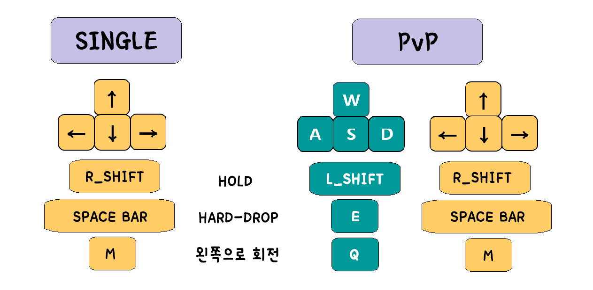

# 2020-2-OSSP-CP-17woljang-9

  
tetris made with pygame  
**Team Leader**: [heesue-coder](https://github.com/heesue-coder)  
**Team Member**: [c2lv](https://github.com/c2lv), [RoJooHee](https://github.com/RoJooHee)  

## How to play
### 시작 전 준비 사항(OS: Window 10)
1. 터미널에 `git clone https://github.com/CSID-DGU/2020-2-OSSP-CP-17woljang-9.git tetrisKingdom` 입력  
(터미널 실행 경로에서 tetrisKingdom이라는 이름의 폴더에 해당 프로젝트 복사)

2. `pip install virtualenv` → `virtualenv venv`  
(virtualenv 모듈 사용하여 해당 경로에 venv라는 이름의 가상환경 설치)

3. `cd venv/Scripts/ && source activate && cd ../..`  
(venv/Scripts 디렉토리로 이동 후 venv 가상환경 실행 후 다시 원래 경로로 복귀)

4. `cd TETRIS_KINGDOM && python tetrisKingdom.py`  
(TETRIS_KINGDOM 디렉토리로 이동 후 게임 실행)

### 조작키 안내

## Introduce
### 게임 소개
지난 학기 오픈소스 테트리스 프로젝트인 [OMPYTRIS](https://github.com/CSID-DGU/2020-1-OSSP1-OpenMind-1)의 코드를 수정/보완하고 새로운 기능을 추가하여 흥미요소를 더한 게임  
Single, PvP, Gravity, Time Attack 총 4가지 게임 모드가 있으며 특정 키 입력(debug)을 통해 진입 가능한 연습 모드 존재  
- Single 모드 : 일반 테트리스 게임 모드
- PvP 모드 : 1P, 2P로 나뉘어져 2명이서 즐길 수 있는 게임 모드
- Gravity 모드 : 블록이 쌓일 때 아래가 빈칸일 시, 블록이 아래 비워진 빈칸을 채우며  
동시에 쌓인 블록이 장애물 블록으로 변하는 모드  
- Time attack 모드 : 제한시간 60초가 주어지는 모드 
- 연습 모드 : 레벨, 속도, 콤보 등의 변수를 조작 가능한 모드  

## Score board
| Action             | Score                              |
|--------------------|------------------------------------|
| Block drop         | 10 * level                         |
| Erase 1 line       | 50 * level * 1 + combo_count       |
| Erase 2 lines      | 150 * level * 2 + 2 * combo_count  |
| Erase 3 lines      | 350 * level * 3 + 3 * combo_count  |
| Erase 4 lines      | 1000 * level * 4 + 4 * combo_count |
| Erase Rainbow line | 500 * rainbow_count                |

* combo_count: 누적 콤보 수(10초 안에 콤보 실패 시 누적 콤보 수 초기화)
* Rainbow line: 서로 다른 7가지 블록 색을 포함한 라인(장애물 제외)
* Rainbow count: 누적 레인보우 달성 횟수(초기화 X)

## Screenshots
  
  
  
  
  
  
  
  
  
  
  
  
  

## Etc
[issues and pull requests](캡처사진 모아둔 폴더)  
[발표 자료](발표 자료 모아둔 폴더)  
[협업 과정에 작성/사용한 Wiki](https://github.com/CSID-DGU/2020-2-OSSP-CP-17woljang-9/wiki)